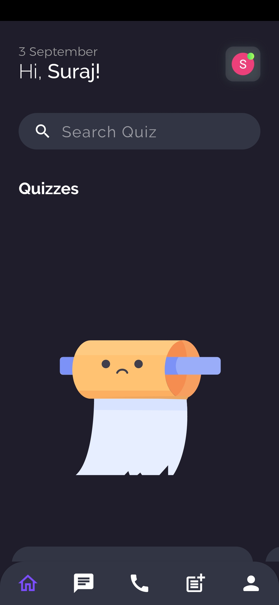
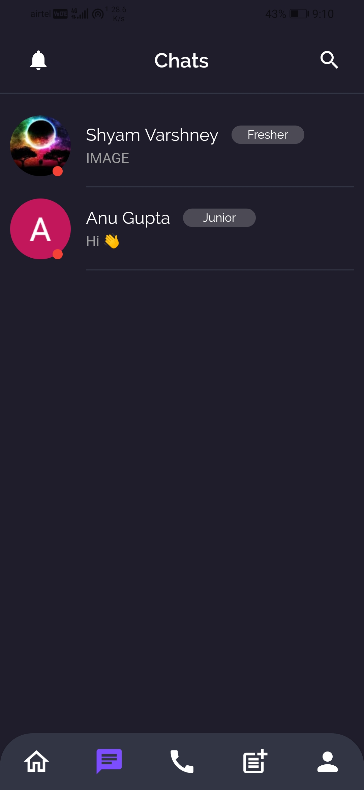
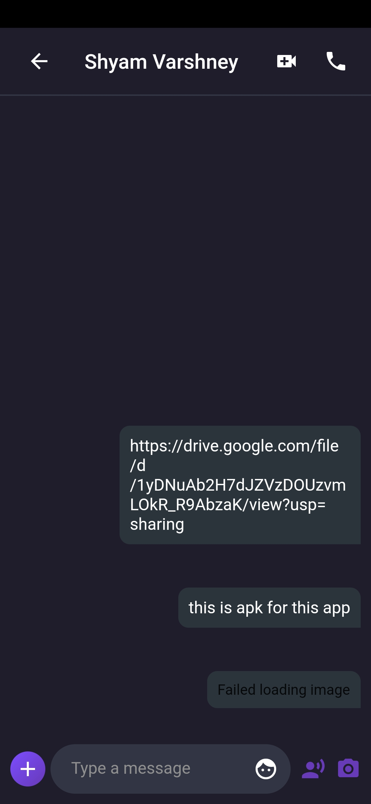
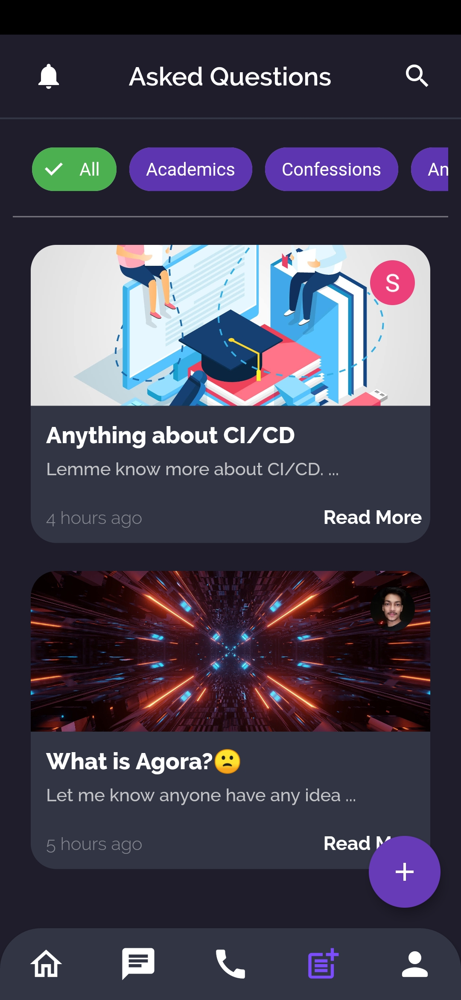
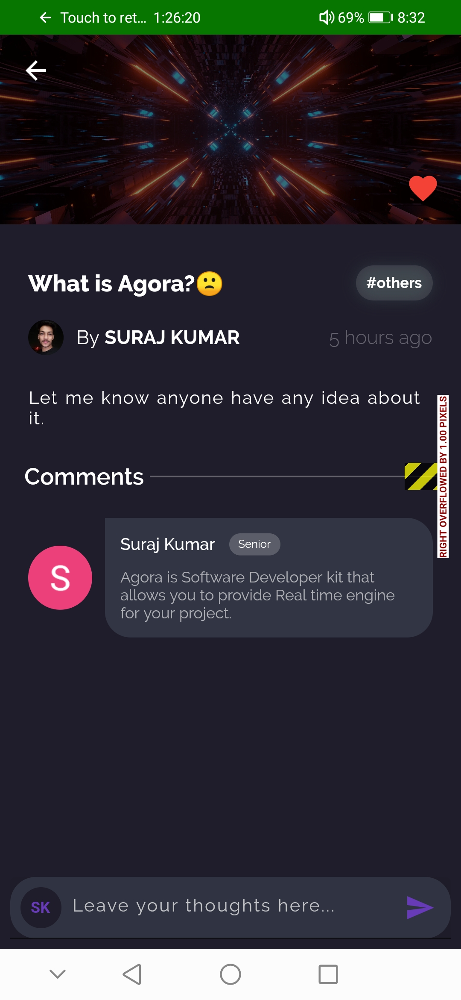
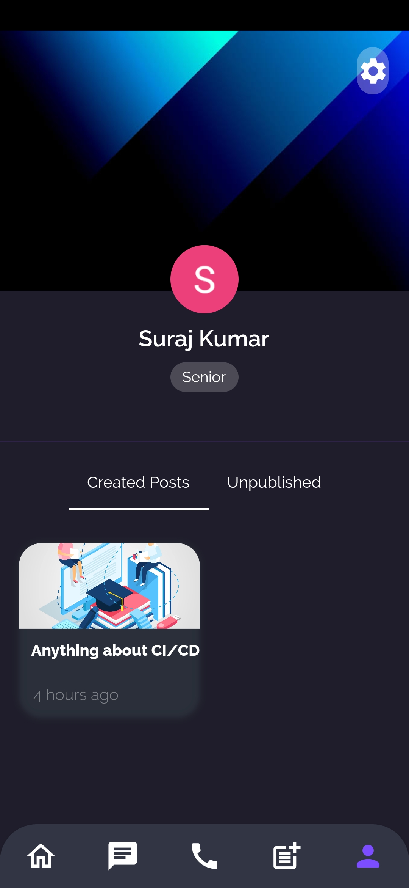

# ``WhatsApp_Clone (Daily Chat)``

A chat app made with Flutter as a frontend and Firebase as a backend

`
For starting a conversation with your friend, its necessary your friend should have a account in the app. Just hit on search button, floating below the screen and search for your friend name and get started.
`

## Setting up Project 🌟':'

- Download and install Flutter SDK and setup your editor [from here](https://flutter.dev/docs/get-started/install/windows)

- Clone the repo
  
  - $ git clone https://github.com/suraj0223/WhatsApp_Clone.git

  - $ cd WhatsApp_Clone

- Start your emulator and run the following commands

  - $ flutter pub get

  - $ flutter run

- Application Starts running in your emulator

---

### Features ✨':'

- [X] Make posts and asks quizz
- [x] signIn / SignUp & Logouts with Gmail
- [x] conduct and play Quizzes with leaderboard
- [X] Video confrencing
- [X] voice Calling
- [X] Chat Encryption
- [X] Screen shot disables for quizz screen

### Future work 🛠':'

- [ ] Custom Theme
- [ ] Messenging notification with deep linking 
- [ ] e-library support
- [ ] Upload Resume and job listings.
- [ ] Advanced test conduct

---

### Screenshots 📸

 

 

---

## Tools & Technology Used ⚓':'

- Agora SDK
- Google Email Auth
- Firestore storage
- Firebase RealTime Database
- AES Encryption
- Flutter & Dart
- Lottie
- Figma 
- SQLite

