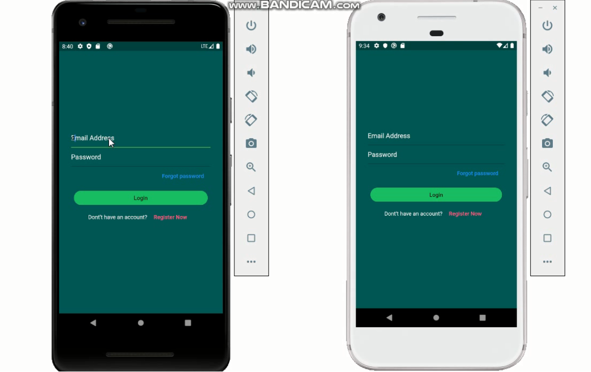
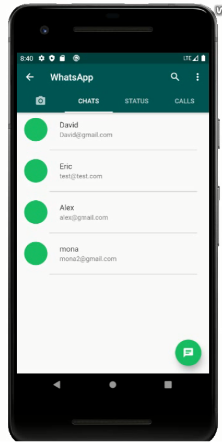
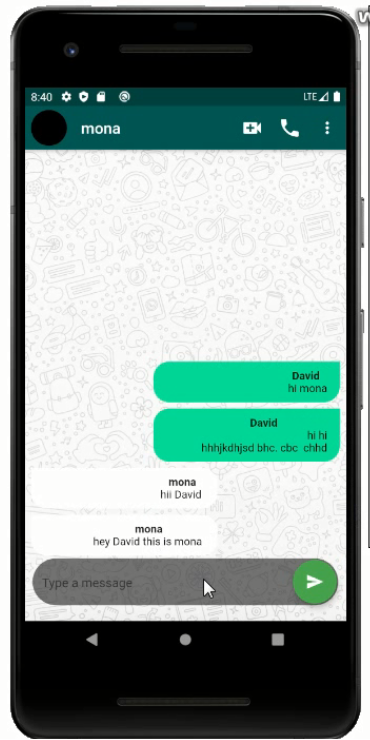
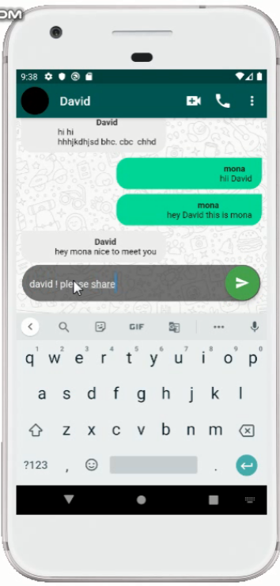

# WhatsApp_Clone 

A fully functioning whatsapp clone build with flutter and firebase. 

`For starting a conversation with your friend, its necessary your friend should have a account in the app. Just hit on search button, floating below the screen and search for your friend name and get started.
`

## Setting up Project : 
- Download and install Flutter SDK and setup your editor [from here](https://flutter.dev/docs/get-started/install/windows)

- Clone the repo 
  
  `$ git clone https://github.com/suraj0223/WhatsApp_Clone.git`

  `$ cd WhatsApp_Clone`

- Start your emulator and run the following commands

  `$ flutter pub get`

  `$ flutter run`

- Application Starts running in your emulator

### Features : 

- [X] Create a account
- [x] signIn / SignUp
- [x] Logout
- [x] Search for peoples
- [X] Conversation

### Upcoming : 
- [ ] Dark Theme
- [ ] Login with Google
- [ ] Staus Update
- [ ] Profile Icon Update

---

## ScreenShots
- `Login Screen` : Enter your credential if you have already have an account.
  - [X] Valid Email Id
  - [X] Your Password

- `Home Screen` : After Successful validation of credentials user navigated to Home Screen.

  

- `Chat Screen` : Just Tap on below floating bar an automatic keyboard appears for generating a message. Type your message and hit on Green Arrow.

 

