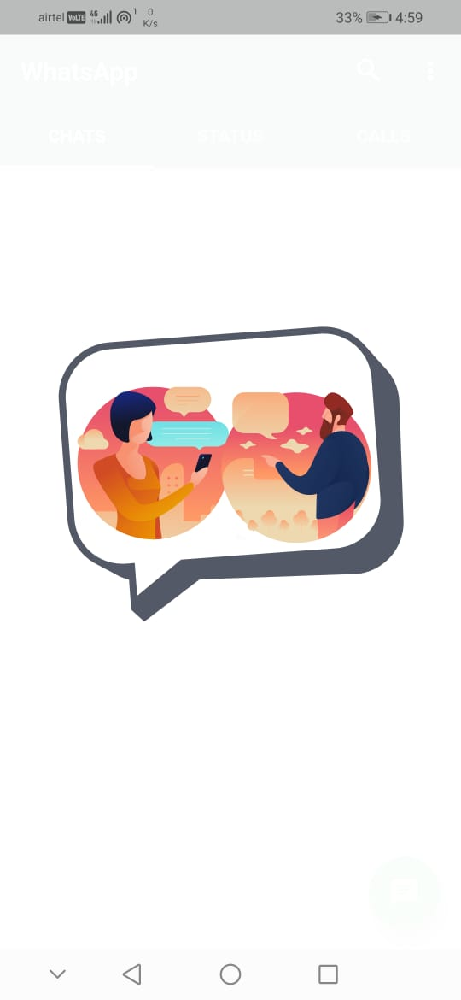
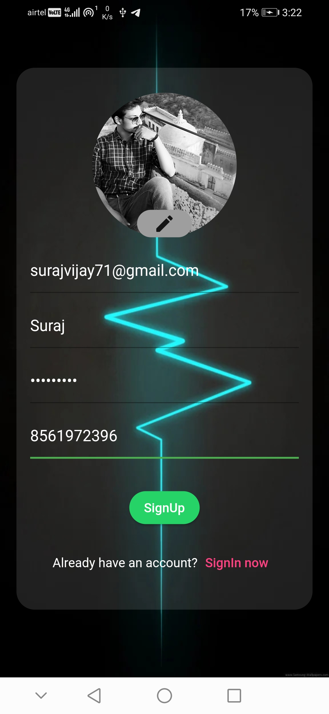
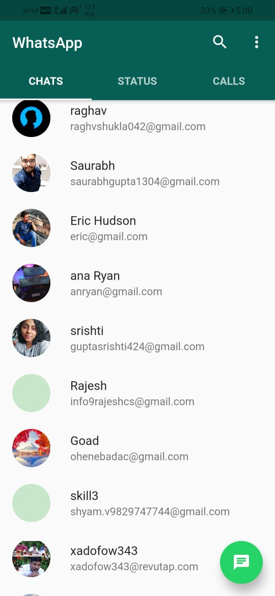
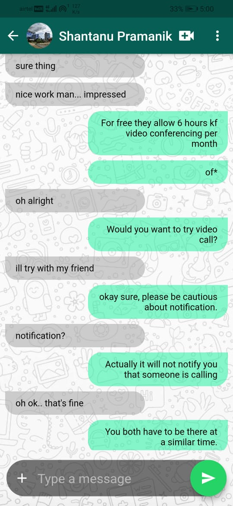
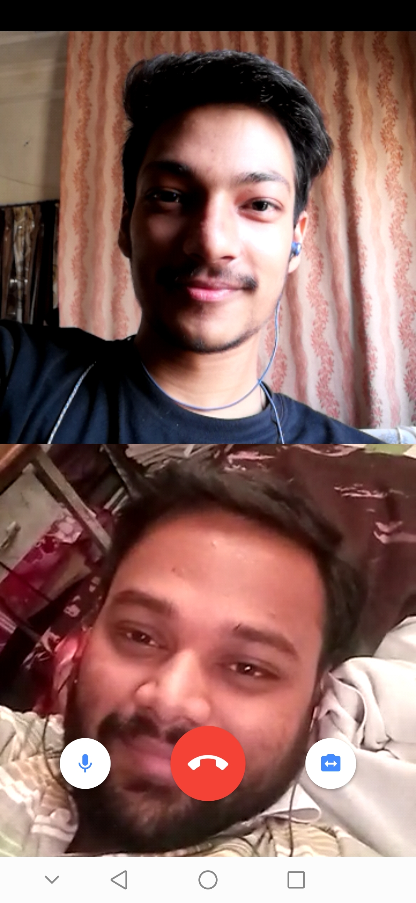

# ``WhatsApp_Clone (Daily Chat)``


A chat app made with Flutter as a frontend and Firebase as a backend

```
For starting a conversation with your friend, its necessary your friend should have a account in the app. Just hit on search button, floating below the screen and search for your friend name and get started.
```

## Setting up Project ':'

- Download and install Flutter SDK and setup your editor [from here](https://flutter.dev/docs/get-started/install/windows)

- Clone the repo
  
  `$ git clone https://github.com/suraj0223/WhatsApp_Clone.git`

  `$ cd WhatsApp_Clone`

- Start your emulator and run the following commands

  `$ flutter pub get`

  `$ flutter run`

- Application Starts running in your emulator

---

### Features ':'

- [X] Create a account
- [x] signIn / SignUp
- [x] Logout
- [x] Search for peoples
- [X] Conversation
- [X] Video confrencing
- [X] Internet Calling
- [X] Set your Profile
- [X] Chat Encryption

### Upcoming ':'

- [ ] Dark Theme
- [ ] Login with Google
- [ ] Staus Update
- [ ] Profile Icon Update

---

## ScreenShots

<div style="margin:auto;display:block"

<div



</div>

<div




</div>

---

## Tools & Technology Used ':'

- Agora SDK
- Google Email Auth
- Firestore storage
- Firebase RealTime Database
- AES Encryption
- Flutter & Dart
- Lottie
